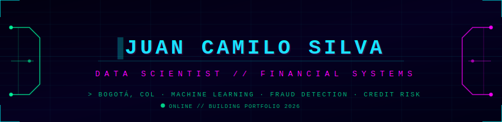

<p align="center">
  
</p>

<p align="center">
  <a href="https://linkedin.com/in/juancasilvape">
    
  </a>
  &nbsp;
  <a href="mailto:juancasilvape@gmail.com">
    
  </a>
  &nbsp;
  
</p>

---

```
> whoami
  Juan Camilo Silva Perilla — Científico de Datos
  Bogotá, Colombia

> cat objetivo.txt
  Meta 2026: posición junior DS/DA en banca colombiana.
  Bancolombia · Davivienda · BTG Pactual · Banco de Bogotá.
  Especialidad: detección de fraude · scoring crediticio · analítica financiera.

> status
  [■■■■■░░░░░] CONSTRUYENDO PORTAFOLIO — Q1/Q2 2026
```

---

## `~/proyectos`

| Proyecto | Descripción | Stack | Estado |
|----------|-------------|-------|--------|
| [🔍 fraud-detection](https://github.com/jcsilva-data/fraud-detection) | ML sobre IEEE-CIS (590k transacciones). EDA con narrativa bancaria, SMOTE, XGBoost, evaluación con AUC-ROC | `XGBoost` `SMOTE` `scikit-learn` | 🔄 EN PROGRESO |

---

## `~/stack`

**[ LENGUAJES ]**

<p>
  
</p>

**[ MACHINE LEARNING & DATOS ]**

<p>
  
  
  
  
  
  
</p>

**[ BI & CLOUD ]**

<p>
  
  
  
  
</p>

---

## `~/certificaciones`

<p>
  
  
  
  
</p>

---

## `~/stats`

<p align="center">
  
  &nbsp;
  
</p>

<p align="center">
  
</p>

---

<p align="center">
  <code>// los proyectos abren puertas. los cursos, no. //</code>
</p>
